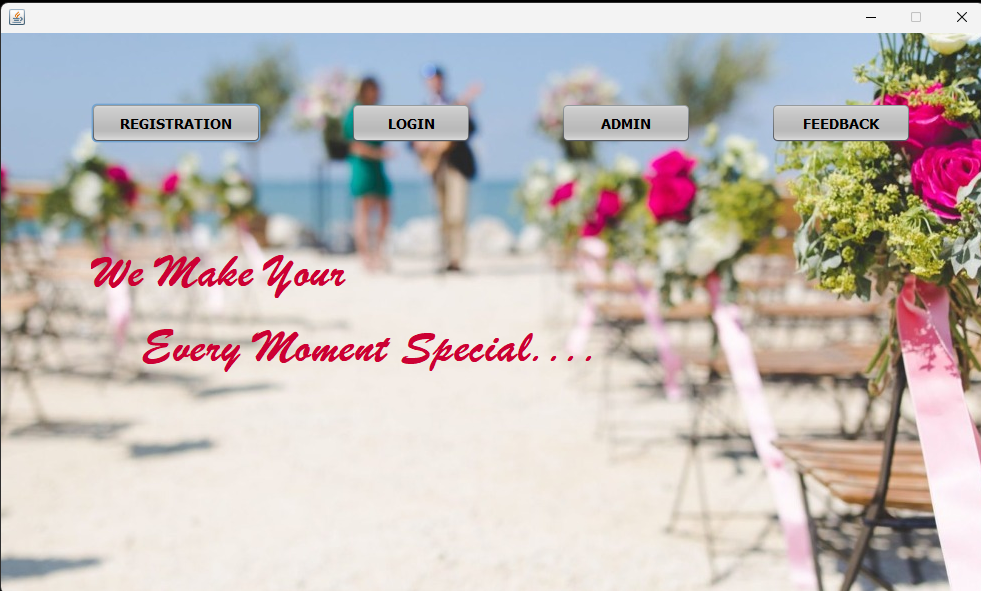
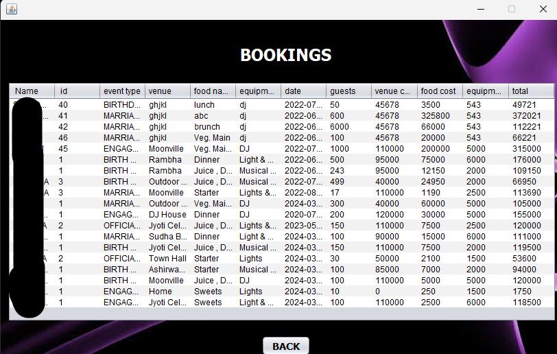

# Event Ease (Event Management System)

A Java-based Event Management System built using NetBeans IDE.

## Table of Contents

- [Introduction](#introduction)
- [Installation](#installation)
  - [Prerequisites](#prerequisites)
  - [NetBeans Installation](#netbeans-installation)
  - [Project Setup](#project-setup)
  - [Required Libraries](#required-libraries)
- [Usage](#usage)
- [Screenshots](#screenshots)
- [Contributing](#contributing)

## Introduction

The Event Management System is a desktop application designed to manage and organize events efficiently. It provides features such as event scheduling, participant management, and report generation.

## Installation

### Prerequisites

Before you begin, ensure you have the following installed:

- [Java Development Kit (JDK)](https://www.oracle.com/java/technologies/javase-jdk11-downloads.html)

### NetBeans Installation

1. Download and install NetBeans IDE from the [official website](https://netbeans.apache.org/download/index.html).

2. Follow the instructions on the website to complete the installation.

### Project Setup

1. Clone the repository:

    ```sh
    git clone https://github.com/Pramodh9653/Event-Ease.git
    cd Event-Ease
    ```

2. Extract the `Event-Ease.zip` file into your project directory.

3. Open NetBeans IDE.

4. In NetBeans, navigate to `File > Open Project`.

5. Select the extracted `Event Ease` project folder and open it.

6. Build the project by clicking on `Build > Build Main Project` or pressing `F11`.

### Required Libraries

1. Download the `mysql-connector.jar` file from [here](http://www.java2s.com/Code/JarDownload/jcalendar/jcalendar-1.4.jar.zip).

2. Download the `jcalendar.jar` file from [here](https://repo1.maven.org/maven2/com/mysql/mysql-connector-j/8.0.31/mysql-connector-j-8.0.31.jar).

3. Add these JAR files to your project in NetBeans:
   - Right-click on the project in the Projects window.
   - Select `Properties`.
   - Go to `Libraries`.
   - Click `Add JAR/Folder`.
   - Navigate to and select the `mysql-connector.jar` and `jcalendar.jar` files.

## Usage

1. Run the project by clicking on `Run > Run Main Project` or pressing `F6`.

2. Follow the on-screen instructions to use the Event Management System.

## Screenshots

Here are some screenshots of the application in action:

### Home Screen


### Participant Management


## Contributing

1. Fork the repository.
2. Create a new branch (`git checkout -b feature-branch`).
3. Make your changes.
4. Commit your changes (`git commit -m 'Add feature'`).
5. Push to the branch (`git push origin feature-branch`).
6. Open a Pull Request.


## Member

T. PRAMODH KUMAR 

Project Link: [https://github.com/Pramodh9653/Event-Ease](https://github.com/Pramodh9653/Event-Ease)

[Back to top](#event-management-system)
